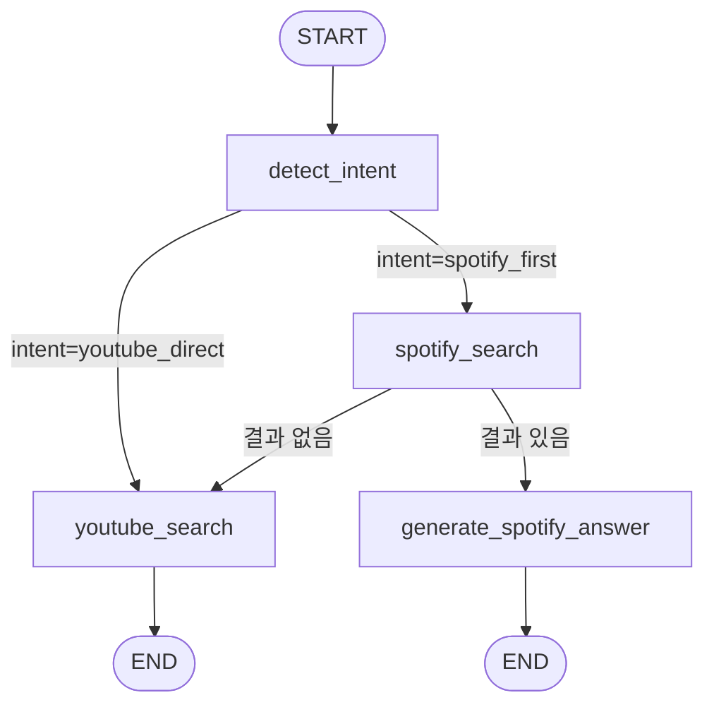

# 🎵 음악 추천 RAG 챗봇

Spotify 오디오 특성 기반 RAG와 YouTube 실시간 검색 기반 RAG를 LangGraph로 라우팅하는
음악 추천 챗봇. Spotify 데이터셋에 없는 아티스트/콘텐츠(라이브, 커버, 플레이리스트 등)는
자동으로 YouTube 검색으로 폴백합니다.

---

## 1. 전체 아키텍처



| 노드 | 역할 |
|---|---|
| `detect_intent` | 질문 분석 → intent, artist_variants, song, search_style 추출 (대화 히스토리 참조 포함) |
| `spotify_search` | Spotify 벡터 검색 + 결과 유효성 검증 (아티스트 fuzzy matching 포함) |
| `youtube_search` | YouTube API 검색 + 청킹 + 임시 임베딩 재검색 + 답변 생성 |
| `generate_spotify_answer` | Spotify 검색 결과 기반 답변 생성 |

**라우팅 기준**

- `detect_intent` 이후: 라이브 영상, 커버 버전, 플레이리스트 등 Spotify 카탈로그에 원천적으로
  존재할 수 없는 콘텐츠 요청, **또는 사용자가 "유튜브에서 찾아줘"처럼 플랫폼을 명시한 경우**
  (`youtube_direct`)는 Spotify를 건너뛰고 바로 YouTube로. 그 외 일반 추천 요청(`spotify_first`)은
  Spotify를 먼저 시도합니다.
- `spotify_search` 이후: 아티스트가 데이터셋에 없거나 검색 결과의 유사도가 낮으면
  자동으로 YouTube 검색으로 폴백합니다.

---

## 2. Spotify RAG

### 2.1 데이터셋

Spotify Web API, Apple Music API 모두 유료화 정책 변경으로 접근이 제한되어(무료 티어로는
카탈로그 검색/오디오 피처 조회가 사실상 불가능해짐), 대신 HuggingFace의
[`maharshipandya/spotify-tracks-dataset`](https://huggingface.co/datasets/maharshipandya/spotify-tracks-dataset)
(약 114,000곡)를 사용해 오디오 특성 지표를 자연어 문장으로 변환한 뒤 임베딩합니다.

**이 선택으로 인한 한계**

- **최신 곡 반영 불가**: 정적 스냅샷 데이터셋이라 신곡/최신 앨범이 존재하지 않음
- **카탈로그 일부만 포함**: Spotify 전체 카탈로그가 아니라 장르별로 균등 샘플링된 일부만
  포함되어 있어, 실제로 Spotify에 있는 곡/아티스트라도 이 데이터셋엔 없을 수 있음
- 위 두 가지 한계 때문에, 실제 서비스에서는 아티스트나 곡이 데이터셋에 없어서
  **YouTube 폴백으로 넘어가는 빈도가 예상보다 높을 가능성**이 있음

### 2.2 오디오 특성 지표

| 지표 | 범위 | 의미 |
|---|---|---|
| `popularity` | 0 ~ 100 | 인기도 |
| `danceability` | 0.00 ~ 1.00 | 춤추기 좋은 정도 |
| `energy` | 0.0 ~ 1.0 | 강렬함/활동성 |
| `loudness` | 데시벨(dB) | 음량 |
| `speechiness` | ~1.0: 스포큰워드 / 0.33~0.66: 음악+스피치 혼합(랩 등) / ~0.33 미만: 비스피치 | 말/랩 비중 |
| `acousticness` | ~1.0에 가까울수록 어쿠스틱 | 어쿠스틱한 정도 |
| `instrumentalness` | 1.0에 가까울수록 보컬 없음 | 연주곡 여부 |
| `liveness` | 0.8 이상이면 라이브 녹음 가능성 높음 | 현장감 |
| `valence` | 0.0(부정적) ~ 1.0(긍정적) | 곡의 정서 |
| `tempo` | BPM | 템포 |

### 2.3 파이프라인

```
load_dataset("maharshipandya/spotify-tracks-dataset")
    ↓
row_to_text(row)  — 위 지표들을 자연어 문장으로 변환
    ↓
Document(page_content=..., metadata={genre, artists, ...})
    ↓
HuggingFace 로컬 임베딩 (intfloat/multilingual-e5-large)
    ↓
Chroma 벡터스토어 (persist, 최초 1회만 임베딩)
    ↓
spotify_search_with_check(질문, params, vector_store)
    ↓
LLM 답변 생성 (Claude, 실패 시 Ollama 로컬 모델로 폴백)
```

---

## 3. YouTube RAG

Spotify RAG에서 결과를 찾지 못했을 때(또는 라이브/커버/플레이리스트 등 애초에 Spotify
카탈로그에 존재할 수 없는 요청, 혹은 사용자가 유튜브를 명시한 경우) **YouTube Data API v3**로
실시간 검색해 답변을 생성합니다.

```
질문 → extract_search_params → {artist_variants, song, search_style, intent}
    ↓
youtube_search(query_suffix, artist_variants, song)  — YouTube Data API v3 (최대 30개)
    ↓
description_to_documents  — description → Document, 비어있으면 title로 폴백
    ↓
clean_description  — URL/해시태그/타임스탬프 제거
    ↓
RecursiveCharacterTextSplitter (chunk_size=400, chunk_overlap=80)
    ↓
임시 Chroma 벡터스토어 (매 검색마다 UUID로 새 컬렉션 생성, persist 없음)
    ↓
유사도 재검색 (search_style 기준, top_k=3)
    ↓
LLM 답변 생성 + 링크 자동 삽입
```

---

## 4. 대화 히스토리 (멀티턴)

"방금 말한 가수의 라이브 영상도 보여줘"처럼 이전 대화를 참조하는 후속 질문을 처리하기 위해,
최근 대화를 프롬프트에 함께 전달합니다.

```
frontend (같은 세션의 최근 1턴을 {question, answer} 형태로 구성)
    ↓ POST /search  { question, history }
api/models.py  SearchRequest.history
    ↓
main.py  music_search(question, history) → graph.invoke({question, history})
    ↓
MusicState.history
    ↓
detect_intent_node → extract_search_params(question, llm, history)
    ↓
프롬프트에 [이전 대화 참고] 블록으로 삽입 → artist_variants / song 을 이전 맥락에서 채움
```

**설계 메모**

- 토큰 절약과 혼선 방지를 위해 **최근 1턴만** 전달합니다. 여러 턴을 넘기면 LLM이 어느 대화를
  참조해야 하는지 헷갈려 엉뚱한 아티스트를 가져오는 문제가 있었습니다.
- 히스토리는 **같은 세션(대화방) 안에서만** 이어집니다. New chat으로 새 세션을 시작하면
  이전 맥락은 참조되지 않습니다 (일반적인 채팅 서비스와 동일한 동작).

---

## 5. 프론트엔드

`frontend/index.html` 단일 파일(HTML/CSS/JS)로 구성된 채팅 UI입니다.

- **다크 테마** + 보라~핑크 그라디언트, 말풍선 네온 글로우
- **랜딩 화면** → "음악 추천 받기" 클릭 시 채팅 화면으로 전환
- **사이드바 History**: `localStorage` 기반 세션 저장, 세션별 불러오기/삭제, New chat
- 답변의 `source`에 따라 🎧 Spotify / 📺 YouTube 배지 표시
- 답변 내 URL 자동 하이퍼링크(`linkify`), 마크다운 볼드(`**...**`) 렌더링(`boldify`)
- 추천 질문 칩, 입력창 bounce 애니메이션

---

## 6. 평가 (LangSmith)

`eval.py`에서 LangSmith 데이터셋을 만들고 evaluator를 붙여 실행합니다.

```python
def routing_accuracy(run, example):
    predicted = run.outputs.get("source")
    expected = example.outputs.get("expected_source")
    return {'key': 'routing_accuracy', 'score': 1 if predicted == expected else 0}
```

**평가 데이터셋 구성 원칙**

- 정답(`expected_source`)의 기준은 "실제 Spotify 카탈로그"가 아니라
  **"지금 로드된 HuggingFace 데이터셋에 존재하는가"**입니다. 시스템이 판단할 수 있는 건
  이 데이터셋뿐이므로, 이 기준으로 정답을 세워야 라우팅 로직 자체를 정확히 검증할 수 있습니다.
- 데이터셋 존재 여부는 pandas로 직접 확인 후 라벨링합니다.

```python
df = spotify_data['train'].to_pandas()
df[df['artists'].str.contains('5 Seconds', case=False, na=False)]['artists'].unique()
```

**추가 예정 지표**

- Hallucination 여부: 답변에 언급된 곡이 실제 검색 결과(context) 안에 있는지 검증
- 영상 관련성: YouTube 폴백 시 인터뷰/리액션 등 음악과 무관한 영상이 추천됐는지 (LLM-as-judge)

---

## 7. 파일 구조

```
rag_project/
├── config.py           # 설정값 (경로, 모델명)
├── data_loader.py       # Spotify 데이터 로딩 + row_to_text
├── embedder.py          # 임베딩 모델 (HuggingFace, 로컬)
├── vectorstore.py       # Chroma 벡터스토어 연결
├── chunker.py           # YouTube description 청킹
├── retriever.py          # Spotify 검색 검증 + YouTube 검색/청킹
├── generator.py         # LLM(Claude, 폴백 Ollama) + 프롬프트 + 답변 생성
├── main.py              # LangGraph 그래프 정의 + music_search() 진입점
├── eval.py              # LangSmith 평가 데이터셋 + evaluator
├── api/
│   ├── models.py         # FastAPI 요청/응답 스키마
│   └── app.py            # FastAPI 앱
└── frontend/
    └── index.html         # 채팅 UI
```

---

## 8. 실행 방법

### 8.1 초기 설정

```bash
cd rag_project
uv sync
```

`.env` 파일 생성:

```
ANTHROPIC_API_KEY=...
YOUTUBE_API_KEY=...
LANGSMITH_API_KEY=...
```

### 8.2 서버 실행

```bash
uv run uvicorn api.app:app --reload
```

브라우저에서 접속: `http://localhost:8000/static/index.html`

### 8.3 단독 테스트 / 평가

```bash
uv run python main.py    # 파이프라인 단독 실행
uv run python eval.py     # LangSmith 평가 실행
```

---

## 9. LangGraph 구현 노트

```python
class MusicState(TypedDict):
    question: str
    history: list
    intent: str
    artist_variants: list
    song: str
    search_style: str
    spotify_results: list
    need_fallback: bool
    answer: str
    source: str
```

- 노드 4개가 각자 state의 일부 필드만 갱신하고, 라우터 2개는 계산 없이 state 값만 읽어서 분기 판단
  (실제 판단 로직은 노드 함수 안에서 끝내고, 라우터는 그 결과만 참조)
- `music_search(question, history)` 시그니처와 반환 형태(`{"source":..., "answer":...}`)를 유지해서
  `api/app.py`, `frontend/index.html`은 그래프 구조가 바뀌어도 수정 없이 그대로 연결됨

---

## 10. 디버깅 기록 / 설계 결정

### 검색 정확도 — top_k 범위 문제

- **증상**: 데이터셋에 실제로 존재하는 아티스트인데 검색 결과에서 누락됨
- **원인**: 전체 질문 텍스트로 벡터 유사도 검색을 하면, 인지도가 낮거나 질문 표현과 임베딩상
  겹치지 않는 아티스트는 상위 k개 안에 아예 못 들어옴. 검색 알고리즘 문제가 아니라
  **후보 범위가 좁은 것**
- **해결**: 아티스트가 명시된 경우 검색 범위를 확대. `top_k=5 → 1000 → 5000`으로 조정하면서
  실제로 데이터셋 내 8개 곡이 전부 잡히는 지점을 확인함

### 아티스트명/곡명 표기 불일치

- **증상**: "5SOS" vs "5 Seconds of Summer"처럼 약어/정식명 표기 차이로 검색 실패
- **해결**: `extract_search_params()`가 표기 변형을 `artist_variants` 배열로 추출하고,
  `rapidfuzz`의 `fuzz.partial_ratio()`(임계값 85)로 데이터셋 표기와 매칭
- **한계 확인**: `fuzz.partial_ratio('5sos', '5 seconds of summer')`는 57점으로 임계값을 못 넘음.
  즉 **fuzzy matching은 약어를 잡지 못하고**, 약어→정식명 확장은 전적으로 LLM의
  `artist_variants` 추출에 의존함. 두 방법이 각자 다른 실패 케이스를 보완하는 구조
- `artist` 단일 필드는 완전히 제거하고 `artist_variants`(리스트)로 통일

### 프롬프트 안의 예시가 실제 대화를 오염시킨 문제

- **증상**: Maroon 5 얘기를 한 직후 "방금 말한 가수의 라이브 영상"을 요청했는데 5SOS가 나옴
- **원인**: 프롬프트에 few-shot 예시로 `질문: "라이브 영상도 있어?" / 답: {"artist_variants":
  ["5SOS", ...]}`가 하드코딩되어 있었는데, 이게 `{history_text}`(실제 대화)와 형태가 똑같아서
  LLM이 예시를 실제 맥락으로 착각함
- **해결**: 참조형 질문에 대한 구체적 예시 JSON을 삭제. 예시가 필요하면 실제 값 형태가 아닌
  서술형으로 설명하는 것이 안전함

### LLM 응답 형식의 비결정성

- `temperature` 파라미터: Claude 모델에서 지원하지 않아(`temperature is deprecated for this model`)
  제거함. 그 결과 완전한 결정성은 확보할 수 없으므로, **코드 레벨 방어**로 대응
- `response.content`가 문자열이 아니라 **콘텐츠 블록 리스트**로 오는 경우가 있어
  `.replace()`에서 `AttributeError` 발생 → 항상 문자열로 변환하는 헬퍼를 거치도록 수정
- **교훈**: 프롬프트의 지시("반드시 ~하세요")는 강제가 아니라 확률적 요청임. 여분 키 추가,
  hallucination, 형식 이탈이 실제로 반복 발생했고, 결국 **프롬프트(1차 유도) +
  코드 검증/보정(2차 강제)** 이중 방어가 필요하다는 결론

### YouTube 응답 안정성

- 청킹으로 같은 영상이 여러 청크로 나뉘어 링크가 중복 삽입 → `seen_titles`로 중복 제거
- 임시 벡터스토어에 컬렉션명을 지정하지 않으면 이전 검색 결과가 누적되어 다른 아티스트 결과와
  섞이는 문제 → 검색마다 `uuid`로 고유 컬렉션 생성
- LLM이 검색 결과에 없는 곡을 지어냄 → 프롬프트에 "목록에 없는 곡은 지어내지 말 것" 명시


---

## 11. 다음 단계

- [ ] 평가 지표 확장: Hallucination 검증, 영상 관련성(LLM-as-judge)
- [ ] YouTube 폴백 시 음악과 무관한 영상(인터뷰/리액션/브이로그) 필터링
      — categoryId 필터는 라이브/플레이리스트 요청을 놓칠 위험이 있어,
      제목 키워드 필터 + `search_style` 인지형 예외처리 방향으로 검토 중
- [ ] 유사곡 추천 기능 (곡명으로 seed 곡 검색 → 해당 곡의 특성 텍스트로 재검색)
- [ ] Docker 패키징 + docker compose
- [ ] AWS EC2 배포